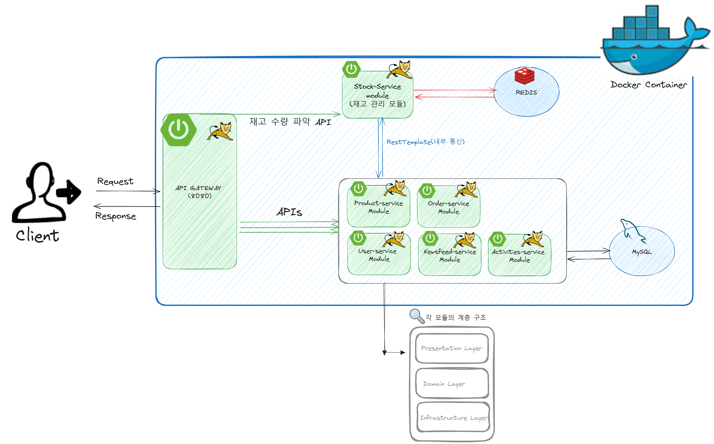
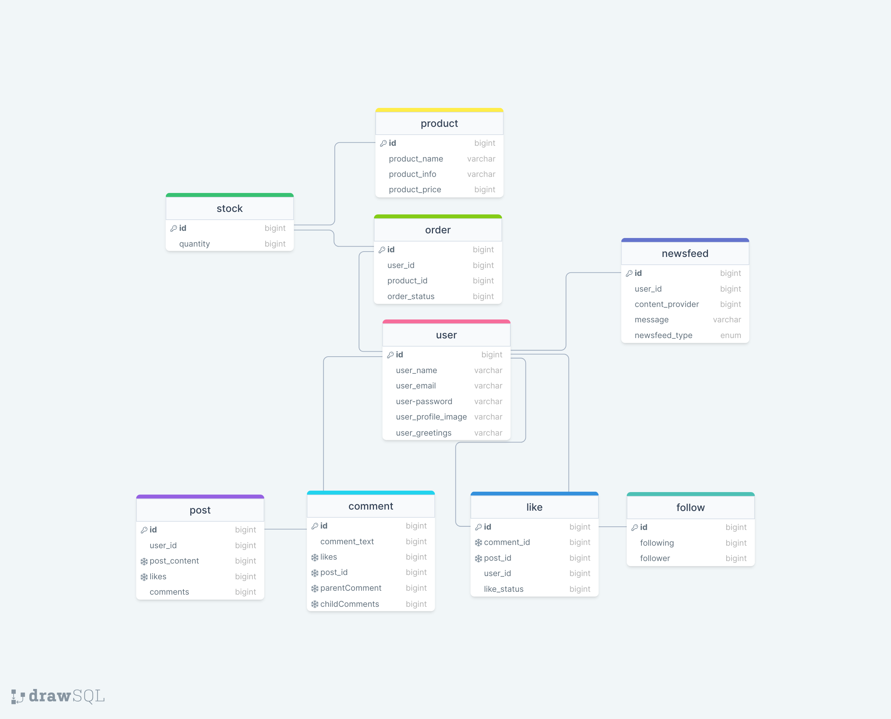

# 📌 reservation-purchase-rest-api (MSA)

모놀리식 구조로 시작한 프로젝트를 **MSA 구조로 전환**하고, **예약/구매(주문) 기능을 추가**하며 고도화한 REST API 프로젝트입니다.  
서비스 확장/유지보수/운영 관점에서 발생한 문제를 해결하기 위해 **API Gateway**, **재고 전용 서비스(Stock-service)** 중심의 아키텍처로 재구성했습니다.

---

## 목차
1. [프로젝트 개요](#프로젝트-개요)
2. [프로젝트 핵심 목표](#프로젝트-핵심-목표)
3. [서비스 구성](#서비스-구성)
4. [기술 스택](#기술-스택)
5. [아키텍처](#아키텍처)
6. [ERD](#erd)
7. [설계-구현 이슈와 해결](#설계-구현-이슈와-해결)
8. [프로젝트 구조](#프로젝트-구조)
9. [실행 방법](#실행-방법)
10. [추후 개선 계획](#추후-개선-계획)

---

## 프로젝트 개요

모놀리식 구조 기반의 기본 프로젝트에 **주문/구매 서비스**를 추가하는 과정에서  
서비스 책임 분리, API 노출 방식, 재고 처리의 일관성 문제를 해결하기 위해 **MSA 전환**을 진행했습니다.

---

## 프로젝트 핵심 목표

- 모놀리식 구조의 한계를 경험하고 **마이크로서비스로 분리**
- 외부 노출 API를 통합하기 위해 **API Gateway 도입**
- 재고 관련 Redis 접근 중복을 없애기 위해 **Stock-service 단일 진입점**으로 설계
- 도커 컨테이너 기반으로 서비스들을 띄워 **운영/실행 단순화**

---

## 서비스 구성

- **api-gateway**: 외부 요청 단일 진입점 (클라이언트는 게이트웨이만 호출)
- **user-service**: 사용자 도메인
- **product-service**: 상품 도메인
- **order-service**: 주문/구매 도메인
- **stock-service**: 재고 전용 서비스 (Redis 단일 접근)
- **newsfeed-service**: 알림/피드 도메인
- **activities-service**: 활동/기록 도메인
- **eureka-server**: 서비스 디스커버리

---

## 기술 스택

> 버전은 레포의 `build.gradle` / 각 서비스 `build.gradle` 기준으로 관리합니다.

### Backend / Framework
- Java (JDK 17)
- Spring Boot
- Spring Web (REST API)

### Microservice / Cloud
- Spring Cloud Gateway (API Gateway)
- Eureka Server (Service Discovery)

### Data / Cache
- MySQL (RDBMS)
- Redis (실시간 재고 캐시/수량 관리)

### Build / DevOps
- Gradle
- Docker / Docker Compose

### Security / Auth
- Spring Security
- JWT (토큰 기반 인증)

### Communication
- 내부 서비스 간 통신: REST 기반 (서비스 간 호출)

---

## 아키텍처

- 클라이언트 요청은 **API Gateway**로 들어옵니다.
- 게이트웨이는 내부 마이크로서비스로 라우팅합니다.
- 재고에 영향을 주는 기능(상품 등록/삭제, 구매 후 차감 등)은 **Stock-service**를 통해서만 Redis를 접근합니다.
- 데이터 저장소는 MySQL(영속) + Redis(실시간 재고)로 구성합니다.



---

## ERD

서비스 도메인(유저/주문/상품/재고/피드/게시물/댓글/좋아요/팔로우 등) 관계를 나타냅니다.



---

## 설계-구현 이슈와 해결

### Issue 1) 주문/구매 기능 추가 과정에서 “재고 관리 분리” 필요
**문제**  
기존 모놀리식 구조의 프로젝트에 주문/구매 서비스를 추가하는 과정에서,  
재고만 관리하는 재고 관리 서비스를 따로 운영하는 것이 효율적이라고 판단했습니다.

**해결 방안**  
각 서비스를 독립적인 구조로 분리하여 운영하는 것이 유지보수/확장성/운영 측면에서 더 낫다고 판단하여  
**MSA 구조로 전환**을 추진했습니다.

**해결 과정**  
각 서비스 모듈을 독립적으로 분리하고 **도커 컨테이너로 실행** 가능하도록 구성하여  
모놀리식 구조에서 MSA 구조로 전환했습니다.

---

### Issue 2) 서비스 분리 후, 클라이언트가 “각 서비스 API를 다 알아야 하는 문제”
**문제**  
각 서비스 모듈을 분리하고 나니 클라이언트에 제공되는 API가 분리되는 문제가 발생했습니다.  
이로 인해 클라이언트는 각 서버가 제공하는 API 목록과 요청 대상 서버를 알아야 하는 부담이 생겼습니다.

**해결 방안**  
외부 노출 API는 통합하고 내부 서비스 구조는 숨기기 위해 **API Gateway 도입 필요성**을 인지했습니다.

**해결 과정**  
API Gateway 모듈을 구성하고, 외부에서 들어오는 요청은 **Gateway에서 내부 마이크로서비스로 라우팅**되도록 설계했습니다.

---

### Issue 3) 재고 관련 기능마다 Redis 접근 코드가 중복되는 문제
**문제**  
각 모듈을 분리한 후, 아래 기능들에서 Redis 접근 코드가 중복되었습니다.
- 상품 등록 / 삭제
- 재고 수량 확인
- 상품 구매 후 재고 차감

**해결 방안**  
실시간 재고 관리 모듈(**Stock-service**)을 만들어 이 모듈에서만 재고를 관리하도록 구조를 변경했습니다.

**해결 과정**  
Stock-service만 Redis에 접근하게 하고, 다른 서비스에서는 Redis 접근 코드를 제거했습니다.  
재고 증감/조회는 **Stock-service API를 통해서만** 이루어지도록 수정했습니다.

---

## 프로젝트 구조

```txt
MSA_ReservationPurchase
├─ activities-service/
├─ api-gateway/
├─ eureka-server/
├─ newsfeed-service/
├─ order-service/
├─ product-service/
├─ stock-service/
├─ user-service/
├─ docker/
│  ├─ docker-compose.yml
│  ├─ rds.sql
│  ├─ start-rds.sh
│  └─ stop-rds.sh
├─ build.gradle
├─ settings.gradle
├─ README.md
└─ (기타 설정/문서 파일)
